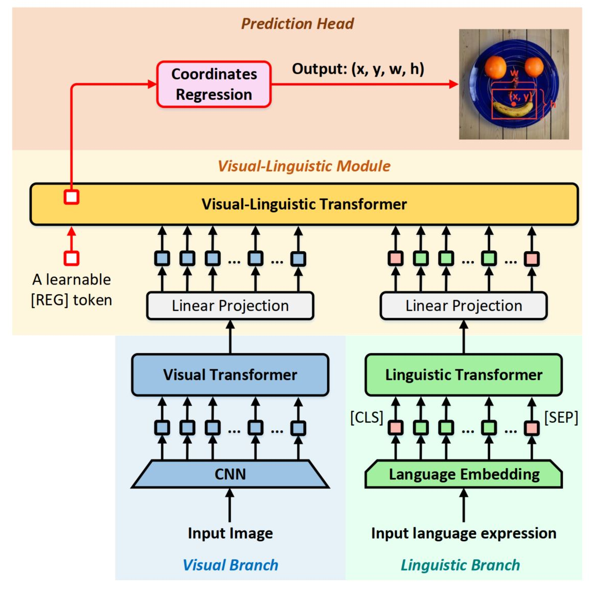

# TransVG
<p align="center">  </p>

This is the official implementation of [**TransVG: End-to-End Visual Grounding with Transformers**](https://arxiv.org/abs/2104.08541). This paper has been accepted by ICCV 2021.

    @article{deng2021transvg,
      title={TransVG: End-to-End Visual Grounding with Transformers},
      author={Deng, Jiajun and Yang, Zhengyuan and Chen, Tianlang and Zhou, Wengang and Li, Houqiang},
      journal={arXiv preprint arXiv:2104.08541},
      year={2021}
}

### Installation
1.  Clone this repository.
    ```
    git clone https://github.com/djiajunustc/TransVG
    ```

2.  Prepare for the running environment. 

    You can either use the docker image we provide, or follow the installation steps in [`ReSC`](https://github.com/zyang-ur/ReSC). 

    ```
    docker pull djiajun1206/vg:pytorch1.5
    ```

3.  Prepare the DETR model.
    ```
    bash ./checkpoints/download_detr_model.sh
    ```

4.  Prepare the data following the README in ./data and ./ln_data folders.

### Training and Evaluation

1.  Training
    ```
    CUDA_VISIBLE_DEVICES=0,1,2,3,4,5,6,7 python -m torch.distributed.launch --nproc_per_node=8 --use_env train.py --data_root ./ln_data/ --batch_size 8 --lr 0.0001 --output_dir ./outputs/2021_08_12/referit --lr_visu_tra 0.00001 --lr_visu_cnn 0.00001 --lr_bert 0.00001 --model_name TransVG --dataset referit --max_query_len 40 --dec_layer 0 --backbone resnet50 --detr_model ./checkpoints/detr-r50.pth --aug_crop --aug_scale --aug_translate
    ```

2.  Evaluation
    ```
    CUDA_VISIBLE_DEVICES=0,1,2,3,4,5,6,7 python -m torch.distributed.launch --nproc_per_node=8 --use_env eval.py --data_root ./ln_data/ --batch_size 8 --output_dir $output_dir --model_name TransVG --dataset referit --max_query_len 40 --dec_layer 0 --backbone resnet101 --num_workers 4 --imsize 640 --eval_set test --eval_model $model_path 
    ```

### Acknowledge
This codebase is partially based on [ReSC](https://github.com/zyang-ur/ReSC) and [DETR](https://github.com/facebookresearch/detr).
