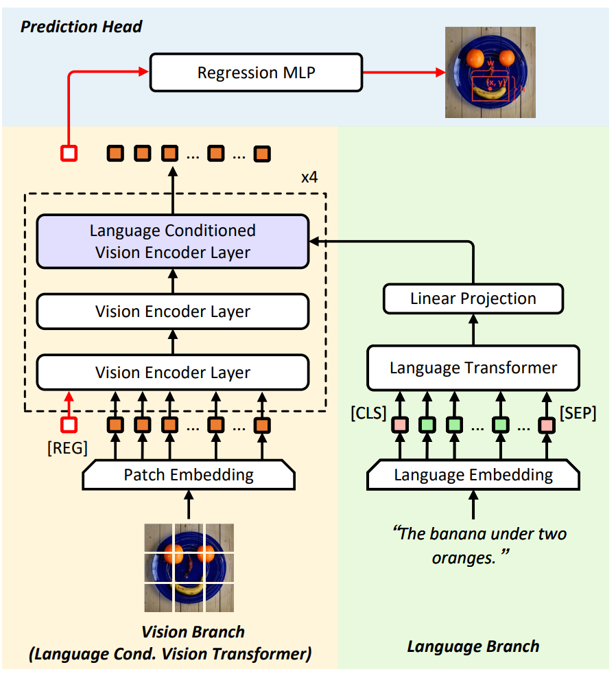

# TransVG++
<p align="center">  </p>

This is the official implementation of [**TransVG++: TransVG++: End-to-End Visual Grounding with Language Conditioned Vision Transformer
**](https://arxiv.org/pdf/2206.06619.pdf). This paper has been accepted by TPAMI 2023.

    @article{deng2023transvg++,
        title={Transvg++: End-to-end visual grounding with language conditioned vision transformer},
        author={Deng, Jiajun and Yang, Zhengyuan and Liu, Daqing and Chen, Tianlang and Zhou, Wengang and Zhang, Yanyong and Li, Houqiang and Ouyang, Wanli},
        journal={IEEE Transactions on Pattern Analysis and Machine Intelligence},
        year={2023},
        publisher={IEEE}
        }
### Installation
1.  Clone this repository.
    ```
    git clone https://github.com/djiajunustc/TransVG
    ```

2. Change branch to TransVG++.
    ```
    cd TransVG
    git checkout transvg++
    ```


2.  Prepare for the running environment. 

    You can either use the docker image we provide, or follow the installation steps in [`ReSC`](https://github.com/zyang-ur/ReSC). 

    ```
    docker pull djiajun1206/vg:pytorch1.5
    ```

### Getting Started

Please refer to [GETTING_STARGTED.md](docs/GETTING_STARTED.md) to learn how to prepare the datasets and pretrained checkpoints.

### Pretrained Models

The vision backbone is pretrained with our re-implemented ViTDet, by excluding the overlap images. These pretrained models are available in [[Gdrive]](https://drive.google.com/drive/folders/14wPf6U7MQnOYsVXgTquubCkQaF0kbD77?usp=sharing)

### Training and Evaluation

We have provided an example in train.sh and test.sh

1.  Training
    ```
    python -m torch.distributed.launch --nproc_per_node=8 --use_env \
    train.py \
    --batch_size 4 \
    --vit_model tiny \
    --bert_model bert-base-uncased \
    --lr 0.0001 \
    --lr_vision 0.00001 \
    --lr_language 0.00001 \
    --dataset gref_umd \
    --aug_scale --aug_crop --aug_translate \
    --visual_pretrained ../ViTDet-Models/vitdet_tiny_for_lvit_640_global_12.pth \
    --max_query_len 40 \
    --epochs 60 --lr_drop 45 \
    --separate_qkv \
    --reg_out_type reg_token \
    --language_modulation cross_attn \
    --without_visual_mask \
    --output_dir outputs/gref_umd_transvg_plusplus_tiny_cross_attn_lr_1e-4
    ```

    We recommend to set --max_query_len 40 for RefCOCOg, and --max_query_len 20 for other datasets. 


2.  Evaluation
    ```
    python -m torch.distributed.launch --nproc_per_node=4 --use_env --master_port 47770 \
    eval.py \
    --batch_size 16 \
    --vit_model tiny \
    --bert_model bert-base-uncased \
    --max_query_len 40 \
    --dataset gref_umd \
    --eval_set test \
    --reg_out_type reg_token \
    --language_modulation cross_attn \
    --without_visual_mask \
    --eval_model outputs/gref_umd_transvg_plusplus_tiny_cross_attn_lr_1e-4/best_checkpoint.pth \
    --output_dir outputs/gref_umd_transvg_plusplus_tiny_cross_attn_lr_1e-4
    ```

### Acknowledge
This codebase is partially based on [ReSC](https://github.com/zyang-ur/ReSC) and [DETR](https://github.com/facebookresearch/detr).
